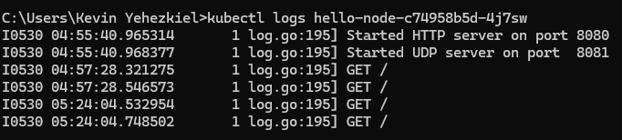
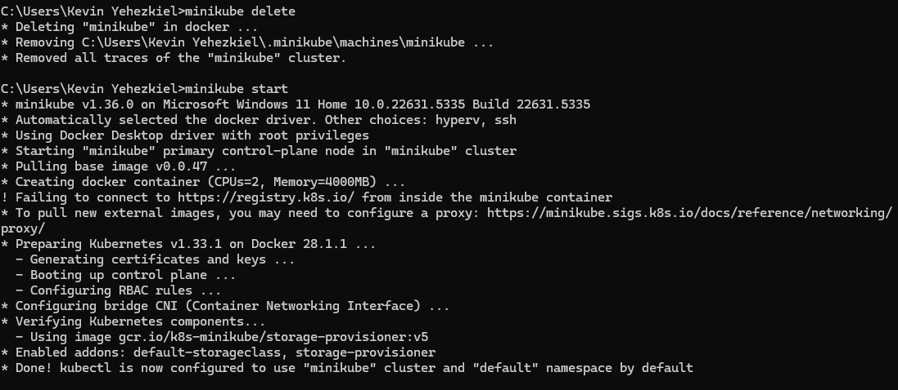
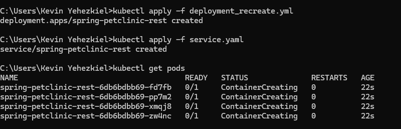
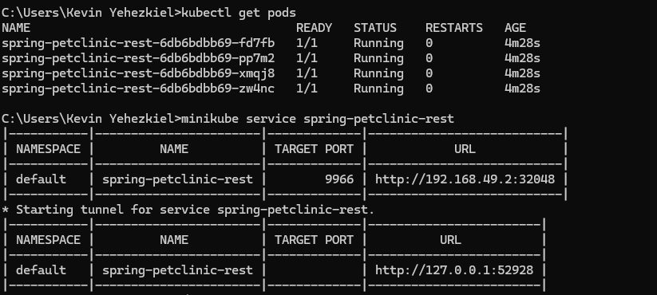
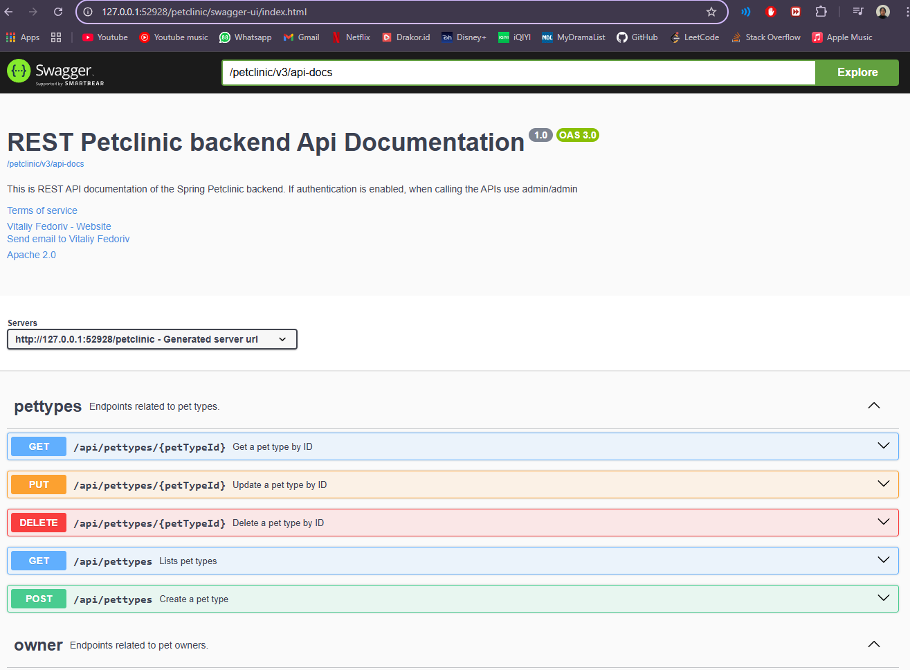

# Adpro-tutorial 11

## Kevin Yehezkiel Manurung - 2206826974

### Hello Minikube
#### 1. Compare the application logs before and after you exposed it as a Service. Try to open the app several times while the proxy into the Service is running. What do you see in the logs? Does the number of logs increase each time you open the app?

Terdapat perbedaan jumlah logs antara sebelum melakukan exposed dan sesudah melakukan exposed sebagai Service. Sebelum di-expose, aplikasi diakses langsung dalam pod dan log mencatat pesan awal (Started HTTP server on port 8080 dan Started UDP server on port 8081). Setelah di-expose sebagai service menggunakan minikube service hello-node, log tetap mencatat pesan awal dan permintaan masuk tetapi sekarang permintaan tersebut diteruskan melalui service yang memungkinkan akses eksternal kepada aplikasi. Setiap kali aplikasi diakses atau di-refresh di browser, jumlah entri log bertambah karena browser mengirimkan GET request ke service. Dapat dilihat pada gambar dengan waktu 06:43:46 untuk log pertama dan 06:59:27 untuk log kedua.

####  2. Notice that there are two versions of `kubectl get` invocation during this tutorial section. The first does not have any option, while the latter has `-n` option with value set to `kube-system`. What is the purpose of the `-n` option and why did the output not list the pods/services that you explicitly created?

Opsi -n pada perintah kubectl get digunakan untuk menentukan namespace tertentu di Kubernetes. Fungsinya sangat penting ketika ada banyak service dengan nama serupa di berbagai namespace. Jika perintah dijalankan tanpa -n, maka secara default hanya resource dari namespace default yang akan ditampilkan. Namespace sendiri berfungsi untuk memisahkan dan mengelompokkan resource dalam sebuah cluster. Sebagai contoh, jika kita menggunakan -n kube-system, maka perintah akan menampilkan resource yang berada dalam namespace kube-system, yaitu namespace yang menyimpan komponen inti Kubernetes seperti DNS dan API server. Sebaliknya, jika -n tidak digunakan, maka hanya resource yang dibuat oleh pengguna secara eksplisit di namespace default yang akan terlihat.

### Rolling Update & Kubernetes Manifest File

#### 1. What is the difference between Rolling Update and Recreate deployment strategy?

Dengan Recreate Deployment, semua pod dari versi lama dihentikan terlebih dahulu sebelum pod versi baru dijalankan. Hal ini menyebabkan aplikasi mengalami downtime karena tidak ada pod yang aktif selama proses transisi.

Sebaliknya, Rolling Update menghindari downtime dengan memperbarui pod secara bertahap. Pod baru akan dibuat satu per satu sementara pod lama masih berjalan, sehingga aplikasi tetap dapat diakses dan terus melayani permintaan selama proses pembaruan berlangsung.

#### 2. Try deploying the Spring Petclinic REST using Recreate deployment strategy and document your attempt.

#### 3. Prepare different manifest files for executing Recreate deployment strategy.
Pada bagian sebelumnya, saya menjalankan langkah-langkah dengan menggunakan sebuah berkas manifest yang saya simpan dengan nama deployment_recreate.yaml. Berkas ini saya buat berdasarkan deployment.yaml, dengan melakukan modifikasi pada strategi deployment dari RollingUpdate menjadi Recreate

#### 4. What do you think are the benefits of using Kubernetes manifest files? Recall your experience in deploying the app manually and compare it to your experience when deploying the same app by applying the manifest files (i.e., invoking `kubectl apply -f` command) to the cluster.
Penggunaan manifest file memberikan keuntungan karena dapat meminimalkan risiko kesalahan dari developer saat melakukan deployment aplikasi. Manifest file berfungsi sebagai dokumentasi prosedur deployment, sehingga proses konfigurasi aplikasi ke depannya tidak perlu dilakukan secara manual.
